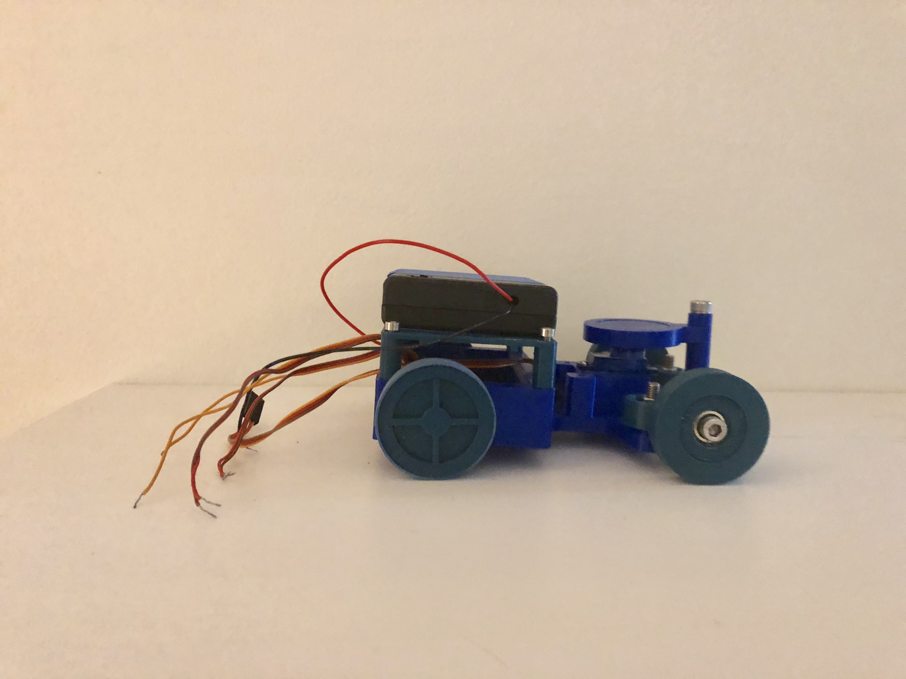
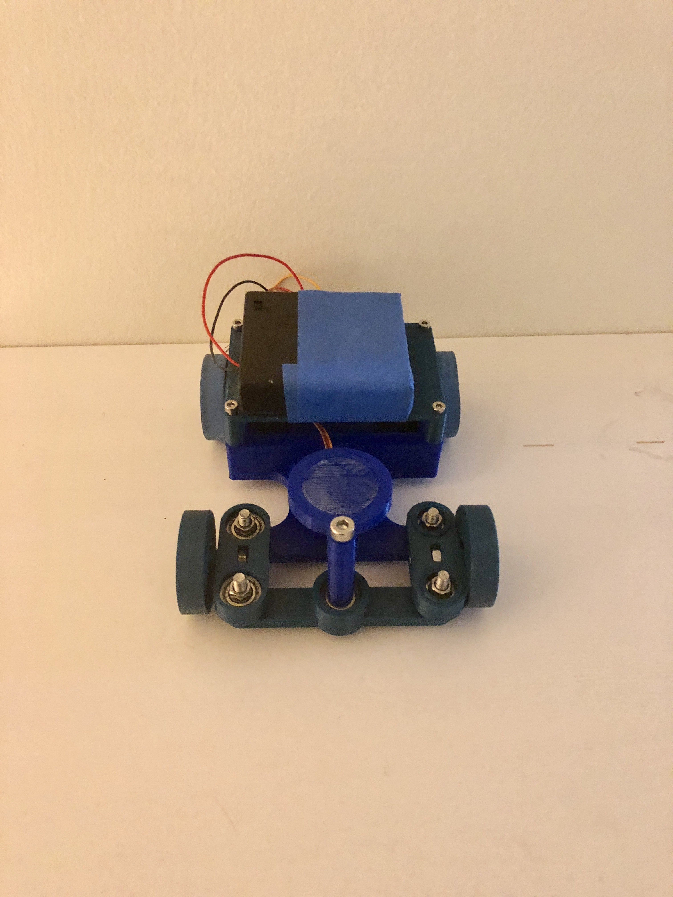

# Remote Control Car

A DIY Remote Control Car built using a 3D printer and Arduino that can be wirelessly controlled by smartphone using Bluetooth. 

## Objectives
* **Mechanical Design** - Design and build the mechanical components of the car using OnShape (open source CAD Software) and a 3D Printer.
* **Electronics** - Use basic electrical components (Arduino, servo motors, etc) to control the car.
* **Wireless Control** - Wirelessly connect to the car using a bluetooth module and design an app to control the car.
* **[Website](https://doug-matthews.github.io/Remote-Control-Car/)** - Create a website to document the project.

## Current Progress

* **Completed** 
  * Designed and built the basic chassis of the car.
  * Found a template for the website and added some content.
  * Obtained a bluetooth module and tested its functionality.

 

  

 

 
 
* **Next Steps**
  * Prototype the electrical circuit and verify that it functions as expected.
  * Add more content to the website.
  * Create a Bluetooth app to control the car.

## Additional Links
* **[OnShape Project](https://cad.onshape.com/documents/23f2e9f6345a567f873c58ac/w/3e798f0b4164c9e516b7c30d/e/92abe29c7836aa413a55de96)** - Check out the 3D design files! 

## Authors

**Doug Matthews**

## License

This project is licensed under the MIT License - see the [LICENSE.md](LICENSE.md) file for details

## Acknowledgments

* To my 7 year old nephew who inspired me to build this project.
